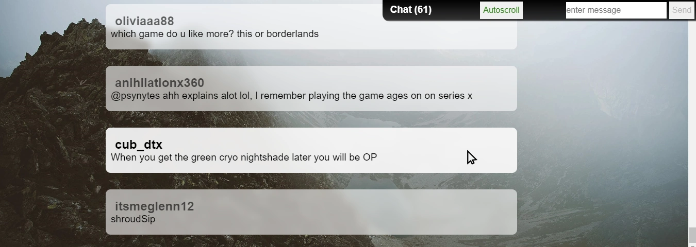

# Twitch Bot


---
## Setup
### [/src/App.svelte](https://github.com/teaguehannam/twitchbot/blob/main/src/App.svelte)
```
BOT_NAME = account name
BOT_KEY = https://twitchapps.com/tmi/ oauth code
```
### [/src/store/global.svelte](https://github.com/teaguehannam/twitchbot/blob/main/src/store/global.js#L3)
```
add stream name to channels
```
---
## Run using [NodeJS](https://nodejs.org/)
```console
npm i
npm run dev
```

## Example responses
### [!kill command](https://github.com/teaguehannam/twitchbot/blob/main/src/App.svelte#L51)
### [!hello reply](https://github.com/teaguehannam/twitchbot/blob/main/src/App.svelte#L54)
